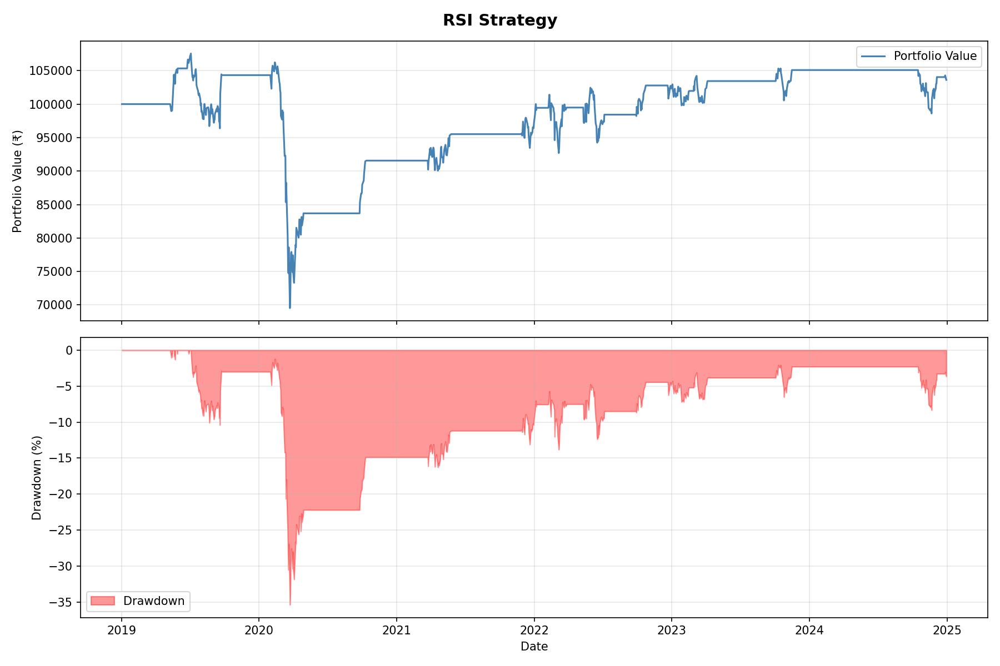
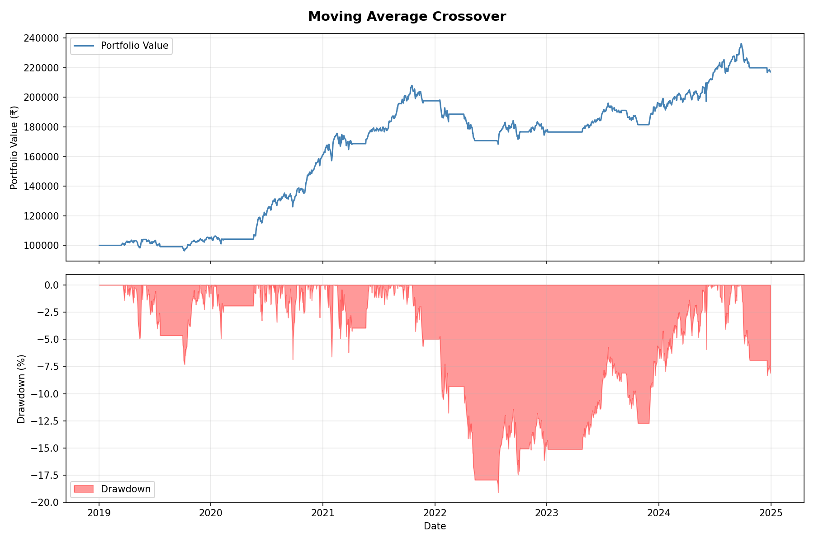
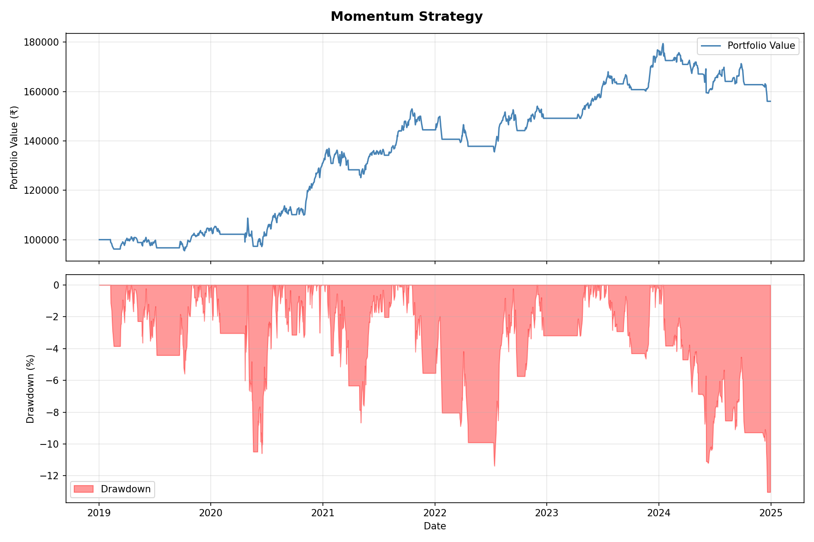

# Stock Price Analysis & Backtested Trading Strategy

Backtesting 3 quantitative trading strategies on the Nifty 50 index using Python.

## Strategies Implemented
- **Moving Average Crossover** — 20/50 day MA crossover signals
- **RSI Strategy** — Buy on oversold (<30), sell on overbought (>70)
- **Momentum Strategy** — Breakout above rolling high / breakdown below rolling low

## Performance Metrics
Each strategy is evaluated on:
- Total Return
- Sharpe Ratio
- Maximum Drawdown
- Win Rate

## Stack
`Python` · `yfinance` · `pandas` · `numpy` · `matplotlib`

## How to Run
```bash
pip install yfinance pandas matplotlib numpy
python main.py
```


Charts are saved to `/plots`. Raw data saved to `/data`.

## Sample Output



